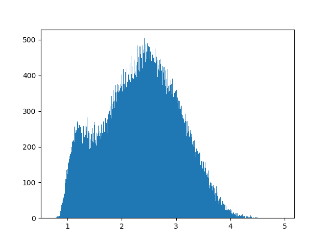

# Processing scripts for AO FDML functional OCT data sets

## Libraries and organization of data and scripts

### Prerequisite libraries

You must have the standard Python scientific stack (python 2.7, numpy, scipy, and matplotlib). The easiest way to do this is to install [Anaconda](https://www.anaconda.com/download/).

You must also have a directory for other Python libraries (e.g. `C:\code` or `~/code/`) and add this directory to your PYTHONPATH system environment variable. Then put (via git clone or http download) following libraries into that directory:

1. https://github.com/rjonnal/cuttlefish

2. https://github.com/rjonnal/fig2gif

### Organization of data and scripts

These scripts are extremely fragile w/r/t data organization, and misplacement of data can result in untraceable bugs and data deletion.

All organization is relative to a data root folder whose location and name is not important. Here we refer to that location as `DATA_ROOT`. It may be, e.g., `C:\Data\` or `~/Data`.

1. Clone or download this repository into `DATA_ROOT`, which will create `DATA_ROOT/processing_ao_fdml_oct`. That will contain master copies of the scripts. Those copies should only be edited if the intention is to merge changes with the trunk.

2. Copy the contents of `DATA_ROOT/processing_ao_fdml_oct` up one level into `DATA_ROOT`.

3. Individual data sets should be located in `DATA_ROOT` in subfolder. We'll call this subfolder `DATA_ROOT/DATA_SET`, e.g. `C:/Data/2018.06.01_00.00.00_my_special_dataset`.

4. The dataset subfolder must have a subfolder called `mat` in it, e.g. `DATA_ROOT/DATA_SET/mat`. This is where the complex B-scan files are. These should be called `AMP_L_00001.mat` ... `AMP_L_NNNNN.mat`, ordered by order of acquisition.

## Running the scripts

### Preprocessing (`ao_fdml_foct_step_0_preprocessing.py`)

Preprocessing consists of loading B-scans from .mat files, determining the fast (resonant) and slow (galvo) turnaround points, cropping the resonant-scanner-distorted portions out of the images, reordering A-scans into their spatial order (as opposed to temporal order) to correct for B-scans' resonant and galvo directions.

#### Important parameters:

1. `scan_fraction`: fraction of B-scans used to compute the bulk en face projection which is used to determine turnarounds; smaller is faster and larger is more accurate/robust.

2. `volume_left_x_start` and `volume_left_x_end`: the starting and ending pixels of the volumes; these can be set to 0 and 159, respectively, for scans of 160 pixels wide. However, the script makes an effort for the book-matched resonant scans to match. Therefore, if the forward scan spans a distance other than pixels 0 to 159, both the forward and reverse volumes will be cropped to matching regions. For example, if the forward volume spans pixels 10 to 170, the reverse volume should reside in pixels 170 to 330. Since, however, the volume ends at 320, the reverse volume is cropped to points 170 to 320 and the forward volume is cropped from 10 to 160, in mirror-image fashion.

#### Running the script:

1. In a shell navigate to `DATA_ROOT` with, e.g., `cd c:\Data`

2. Invoke the script with one parameter, the name of the dataset, e.g.: `python ao_fdml_foct_step_0_preprocessing.py 2018.06.01_00.00.00_my_special_dataset`

This will take considerable time to run. Multiple datasets may be run simultaneously on a multi-core machine by creating multiple shells (command prompts) and performing steps 1 and 2 above for each dataset.

#### Output of the script

1. Spatially-ordered volumes, located in `DATA_SET/volumes/NNNN/processed_data.npy`. These are as described above. Each of these is a `2 x n_slow x n_depth x n_fast` array where the first dimension is size 2, corresponding to each of the forward and backward resonant scans.

2. Spatially-ordered timestamps, located in `DATA_SET/volumes/NNNN/data_time.npy`. These are `2 x n_slow x n_fast` arrays containing the acquisition time for each A-line in `processed_data.npy`.

3. Output of model-based segmentation, located in `DATA_SET/volumes/NNNN/model/`.

4. Flattening offsets, located in `DATA_SET/volumes/NNNN/flat_offsets.npy`, a `2 x n_slow x n_fast` array containing axial offsets which can be used to flatten the volumes.

5. En face projections of various parts of the volume, located in `DATA_SET/volumes/NNNN/projections/`. These are `.npy` files, not `.png` files, so they cannot be viewed with an image viewer. These are the files that can be rendered in the rendering step below.

6. PNG versions of the cone projections, located in `DATA_SET/cone_projections`. These may be useful for deciding on a reference frame for registration in the next step.

### Registration (`ao_fdml_foct_step_1_registration.py`)

Strip-wise registration of volumes. Before running this, look through the images in `DATA_SET/cone_projections` to identify a good reference candidate (i.e. with good cone mosaic quality, minimal visible motion artifacts, and good overlap with the frames soon after stimulus).

#### Important parameters:

1. `oversample_factor`: factor by which to oversample volumes in lateral dimensions before registering; typical value is 7

2. `strip_width`: width of strips to be registered; this is the pre-oversampling width--after oversampling the strip width will be larger; typical value is 5

3. `ref_idx`: choose a volume with a good cone mosaic; see `DATA_SET/cone_projections` to identify good candidates

4. `ref_vol`: 0 or 1, depending on whether it's the forward or backward scan of the resonant scanner

5. `left_crop`: the number of pixels to crop off the left edge of the image in order to remove sinusoidal artifacts. It is important to set this correctly, as the sinusoidal artifacts prevent effective registration of strips. The same number of pixels are cropped from the reference image and the target strips.

6. `right_crop`: same as `left_crop` but for the right side of the image

#### Running the script:

1. In a shell navigate to `DATA_ROOT` with, e.g., `cd c:\Data`

2. Invoke the script with one required parameter, the name of the dataset, e.g.: `python ao_fdml_foct_step_1_registration.py 2018.06.01_00.00.00_my_special_dataset`

3. The script may be invoked with two additional optional parameters, the starting and ending index for frames to register. This permits dividing the data into parts and running the parts on separate cores. As is always the case in python, ranges are specified closed on the left and open on the right, i.e. [start,end). For example, to register 300 volumes, the following could be run in four separate terminals:

    a. `python ao_fdml_foct_step_1_registration.py 2018.06.01_00.00.00_my_special_dataset 0 75`

    b. `python ao_fdml_foct_step_1_registration.py 2018.06.01_00.00.00_my_special_dataset 75 150`
    
    c. `python ao_fdml_foct_step_1_registration.py 2018.06.01_00.00.00_my_special_dataset 150 225`
    
    d. `python ao_fdml_foct_step_1_registration.py 2018.06.01_00.00.00_my_special_dataset 225 300`

#### Output of the script

This script creates a directory `DATA_SET_registered_ref_REFIDX_REFVOL_Xx_Ww` where REFIDX, REFVOL, X, AND W represent the reference frame index, volume number (i.e., 0 or 1), oversampling factor X and strip width W. In this folder are the strip registration statistics used for rendering registered averages and locating cones for phase computations.

### Rendering (`ao_fdml_foct_step_2_render.py`)

Rendering a registered average.

#### Important parameters:

1. `layer_names`: although the data are registered using cone mosaic projections, the resulting strip registration values can be used to render any of the images in the dataset's projections directories (see above).

2. `left_crop` and `right_crop`: as with registration, portions of the image affected by sinusoidal resonant scanning may be cropped before rendering. This improves the overall correspondence of the registered strips, and prevents misaligned structures near the edges from reducing image quality. While the values should be equal or similar to those used for registration, the algorithm does not require this to be so. 

#### Running the script:

1. In a shell navigate to `DATA_ROOT` with, e.g., `cd c:\Data`

2. Invoke the script with one required parameter, the name of the registered dataset, e.g.: `python ao_fdml_foct_step_2_render.py 2018.06.01_00.00.00_my_special_dataset_registered_ref_0001_01_7x_5w`. If invoked just like this, a histogram of "goodness" values will be shown.

3. Invoke the script with two parameters--just as above, but add the goodness threshold, e.g.: `python ao_fdml_foct_step_2_render.py 2018.06.01_00.00.00_my_special_dataset_registered_ref_0001_01_7x_5w 1.5`

4. This will take a long time--especially the volume regsistration portion.

#### Output of the script

This script writes registered averages to the top level of the registration directory.

